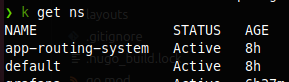
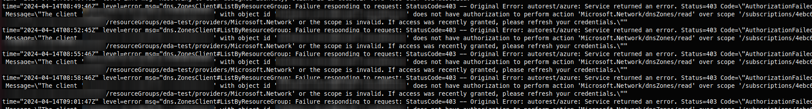
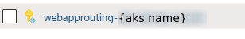
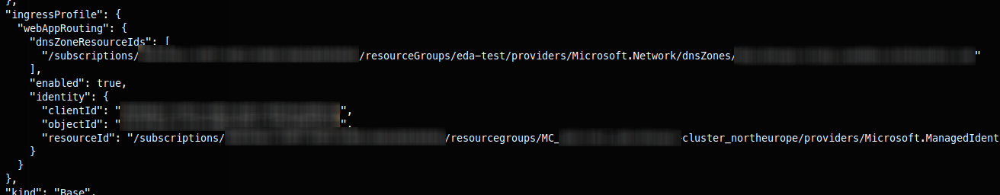
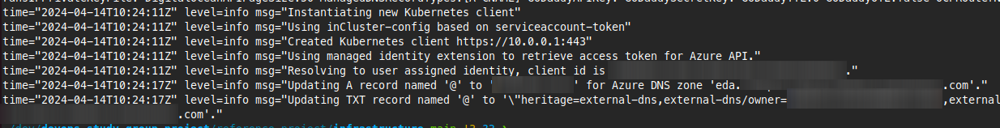

+++
title = "Web App Routing on AKS using Bicep"
date = 2024-04-14T20:32:36+02:00
draft = false
+++

> Note - These features is in preview and I perform somewhat of hacks to fully automate it

> TL;DR - Found not really documented preview feature to set up ingress and external dns in aks using bicep. There is Microsoft's guide to achieve same thing using `az` CLI - https://learn.microsoft.com/en-us/azure/aks/app-routing

## Intro

I'm currently creating a Kubernetes workshop for my co-workers. Most of who are new to Kubernetes and will only use it to deploy and run their applications on a cluster managed by someone else. So, I wanted a quick way to set up an "ingress-ready" AKS cluster, hiding all of the 'magic'.

## App Routing

That's when I found Azure's/AKS's `app routing`, which you can easily enable through the `az cli` ([Microsoft guide](https://learn.microsoft.com/en-us/azure/aks/app-routing)). However, this wasn't enough because idea behind the workshop is to be easily torn down and recreated, and having multiple manual steps like this is annoying. It should be as simple as running IaC script.

### Bicep

I searched for a way to enable this in Bicep but couldn't find human-written info. So, I checked out Microsoft's Bicep reference on AKS instead ( https://learn.microsoft.com/en-us/azure/templates/microsoft.containerservice/managedclusters?pivots=deployment-language-bicep ) and found a section mentioning "approuting". 

```yaml
ingressProfile: {
  webAppRouting: {
    dnsZoneResourceIds: [
      'string'
    ]
    enabled: bool
  }
}
```

It seemed straightforward enough, so I updated my Bicep scripts and redeployed. It created a namespace I didn't have before:



However, when I tried creating an ingress using my DNS Zone's FQDN, it didn't work.

Do I need to manually create a DNS entry? How do I get the external IP of the cluster in Bicep? What's the point of providing DNS Zone resource Ids?

### Investigation

Digging into the `app-routing-system` namespace, I found nginx pods and something called `external-dns`. After a quick search, it seems to be related to this project [here](https://github.com/kubernetes-sigs/external-dns). 

Looking at the logs, I noticed a `403` responses while it tries to list DNS zones. 



Alright, let's grant the `kubelet` identity role with enough permissions, but it still doesn't work.. The logs mention a Client ID, which is a GUID and likely represents some service principal. Checking in Azure Portal, it turns out the app-routing feature creates its own managed identity.



Fair enough, let's update our Bicep script to use the app-routing service principal instead of kubelet...

But Bicep doesn't expose it...

Double-checking with `az aks show ...`, it's all there.



But it's not available in Bicep... or is it hidden somewhere?

### More Bicep 

It's a preview feature, so hiccups are expected. Looking at the managed identity, its name is templated to be `webapprouting-{aks resource name}`, so we can hardcode it. It's also in a different resource group than the one the Bicep script targets, so we can't refer to it directly. But Bicep treats each module as a separate deployment, so we can move this 'hack' to its own module.

```bicep
param aksName string
param dnsZoneName string
param aksNodeResourceGroup string
// Variables
// --------------------------

var contributorRoleDefinitionId = subscriptionResourceId('Microsoft.Authorization/roleDefinitions', 'b24988ac-6180-42a0-ab88-20f7382dd24c')

// Imports
// --------------------------
resource aks 'Microsoft.ContainerService/managedClusters@2023-08-01' existing = {
  name: aksName
}

resource dnsZone 'Microsoft.Network/dnsZones@2023-07-01-preview' existing = {
  name: dnsZoneName
}

// Workaround by importing hardcoded identity, because aks resource curently doesn't expose this id
resource appRoutingIdentity 'Microsoft.ManagedIdentity/userAssignedIdentities@2023-07-31-preview' existing = {
  name: 'webapprouting-${aksName}'
  scope: resourceGroup(aksNodeResourceGroup)
}

// New Resources
// ---------------------------

resource acrPullRole 'Microsoft.Authorization/roleAssignments@2022-04-01' = {
  name: guid(resourceGroup().id, aks.id, contributorRoleDefinitionId)
  scope: dnsZone
  properties: {
    principalId: appRoutingIdentity.properties.principalId
    roleDefinitionId: contributorRoleDefinitionId
    principalType: 'ServicePrincipal'
  }
}

```

and call it after we create our cluster:

```bicep
module dnsZone 'modules/dnszone.bicep' = {...}
module aksCluster 'modules/cluster.bicep' = {...}

module dnsRole 'modules/aksAppRoutingDnsZoneRoles.bicep' = {
  name: 'approuting-dns-role'
  params: {
    aksName: aksCluster.outputs.resourceName
    aksNodeResourceGroup: aksCluster.outputs.nodeResourceGroup
    dnsZoneName: dnsZone.outputs.resourceName
  }
}
```


### Victory

After redeploying our Bicep scripts, checking the logs of the `external-dns` pod again...



Success.