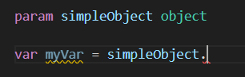
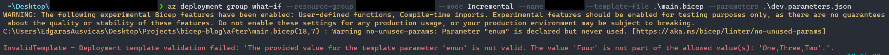

+++
title = "Bicep's User-Defined Types: Enhancing Configuration Structure"
date = 2023-12-24T115:00:00+02:00
draft = false
+++

> Note - These features are considered experimental and Microsoft doesn't recommend using them in production

> TL;DR - Bicep's user-defined types make it easier to structure and organize configuration, sample code -> https://github.com/karosas/bicep-user-defined-type-demo
## Ranty Introduction

Working with client code I sometimes get a little frustrated by the lack of structure and consistency and struggle to figure out what values undocumented `object` parameters are expecting. As well as long parameter files with only primitive type values. This seemed to cause me to spend way more time working on infrastructure than I should have needed. Looking for a solution, I noticed that Bicep has some experimental features, including user-defined types that offered a way to address my issues.

## Experimental Features

To use the following features in your bicep project, you need to create/update your [bicep config](https://learn.microsoft.com/en-us/azure/azure-resource-manager/bicep/bicep-config) and enable these experimental features using

```js
{
    "experimentalFeaturesEnabled": {
        "userDefinedTypes": true,
        "compileTimeImports": true,
        "userDefinedFunctions": true
    },
    // ...
}
```

### User-Defined Types

Bicep already supports objects, but they lack the clarity of a defined class or interface. Accessing these objects does not provide any information about their content. Additionally, using a module that expects `object` parameter(s), it is unclear what values are expected. 



User-defined types solve this problem by allowing you to create a contract that defines the expected content of an object.


While these contracts are my favorite part of user-defined types, they are not limited to objects, they allow introducing various restrictions and limitations, e.g. creating something similar to an enum:


By enforcing these types of restrictions, Bicep ensures that the configuration aligns with the defined rules.




## Type Imports
While user-defined types offer a nice way to structure configurations, by themselves, they have a limitation: they can only be used within the file in which they are defined. This means that if you have multiple modules that could use the same user-defined type parameter, you would need to redefine it in each module. To overcome this limitation, Bicep introduced JavaScript-style [imports](https://learn.microsoft.com/en-us/azure/azure-resource-manager/bicep/bicep-import#import-user-defined-data-types-preview).

By exporting a custom type defined in one module and importing it into another, you can reuse the type without duplicating the definition.

Quick example:
```bicep
// module1.bicep
@export()
type MyType = { ... }

// module2.bicep
import { YourCustomType } from './yourModule.bicep'

param myParam MyType
```

## Putting It All Together

After learning these features, there are 2 targets in my opinion where to apply them:

- Parameters that tend to occur in multiple modules
  - e.g. most if not all of the modules I used required environment name, location, solution name and tags. So I created type for that and each module usage became 3 lines shorter, e.g. from 
  ```bicep
  ...
  params: {
    environment: env
    location: loc
    solution: sol
    tags: tags
  }
  ```
  to:
  ```bicep
  ...
  params: {
    general: general
  }
  ```
- Parameters in the parameter file that can be logically grouped
  - e.g. because of the private networking setup where each private endpoint would have a static IP assigned, the parameter file would end up having XX entries like this for each IP:
  ```js
  "ipAddressStorageAccountBlob": {
    "value": "123.123.123.123"
  }
  ```
  Instead, I created an IP dictionary type, so the parameter file started to look tighter by avoiding that newline bloat:
  ```js
  "ipAddressDict": {
    "value": {
        "storageAccountBlob": "123.123.123.123",
        "storageAccountFile": "123.123.123.123"
    }
  }
  ```

Using this "strategy", I created a sample repo with the structure I ended up with, demonstrating the things described above - https://github.com/karosas/bicep-user-defined-type-demo

## Thoughts / Notes

- I'm still not sure what's the best place for types. For now I like them in a single `types.bicep` file so they're in one central place. However, I see how some of them could be located in relevant modules. e.g. I have a module that creates a private endpoint and I did create a type for configuring networking-related properties (subnet, resource id, sub-resource, etc.) and I see how this type could live inside that private endpoint module instead of central `types.bicep`.
- It's a shame that the current version of vscode bicep extension doesn't seem to support importing functions yet. Or at least it didn't for me - the extension would end up marking the import as an error, however bicep CLI would successfully build the project.

## Conclusion

Bicep's user-defined types have the power to greatly enhance the structure and organization of configuration files. The ability to define custom types allows for clearer contracts between the client and the module.

I hope the ability to import types remotely is next. Maybe go or terraform style, where we can just point to a repository, instead of some package manager?